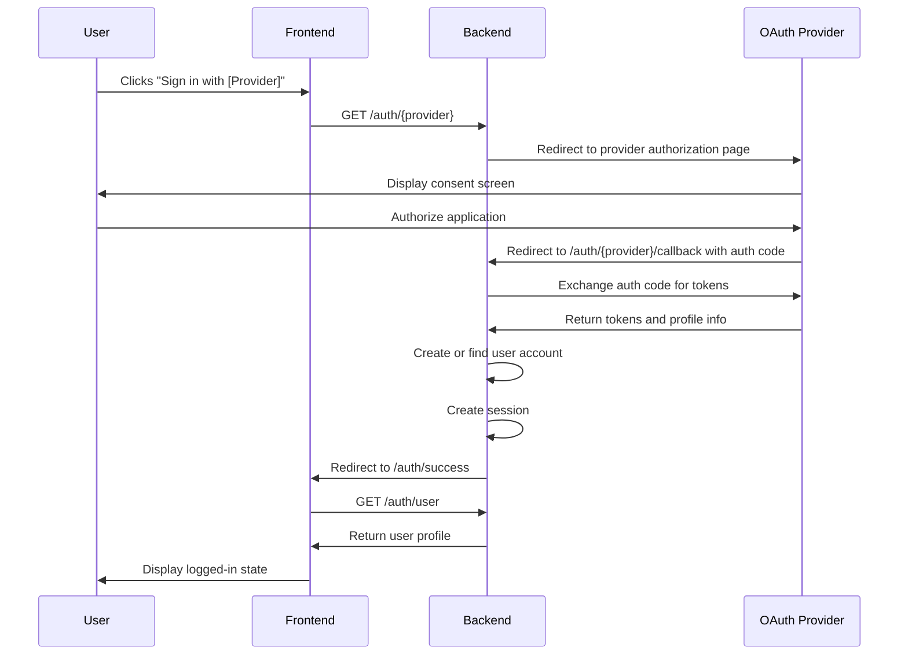
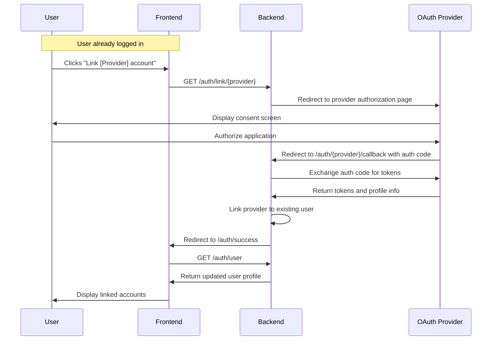
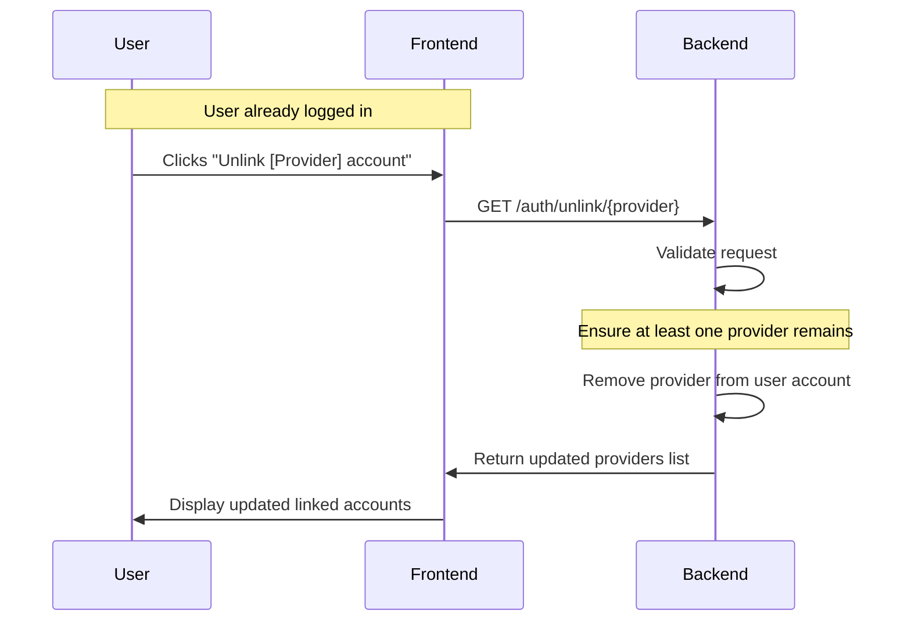
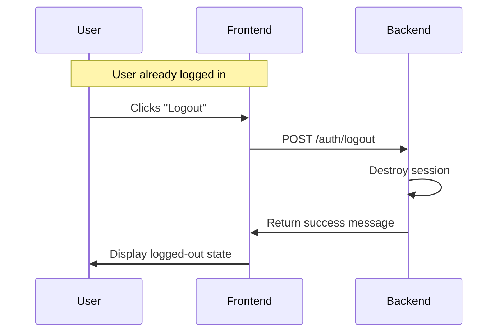
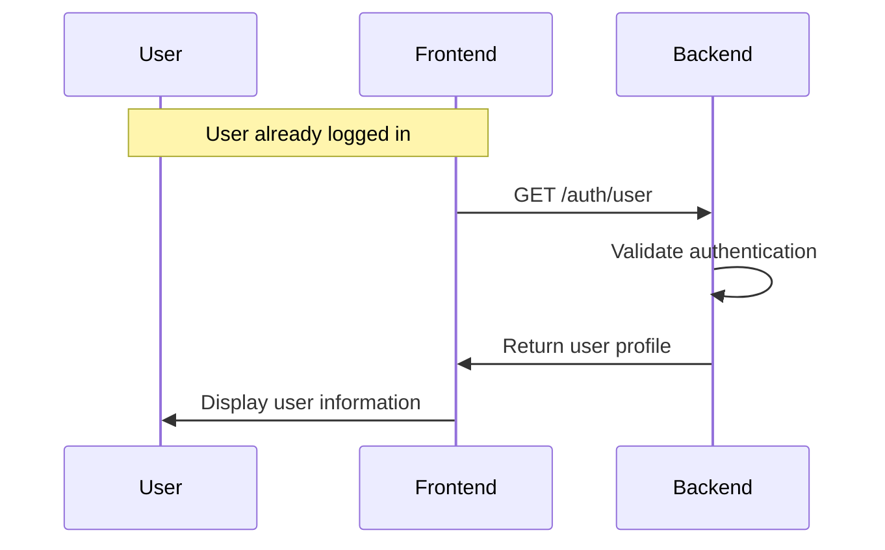
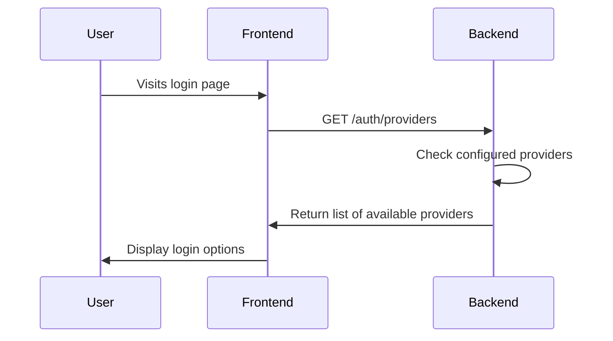
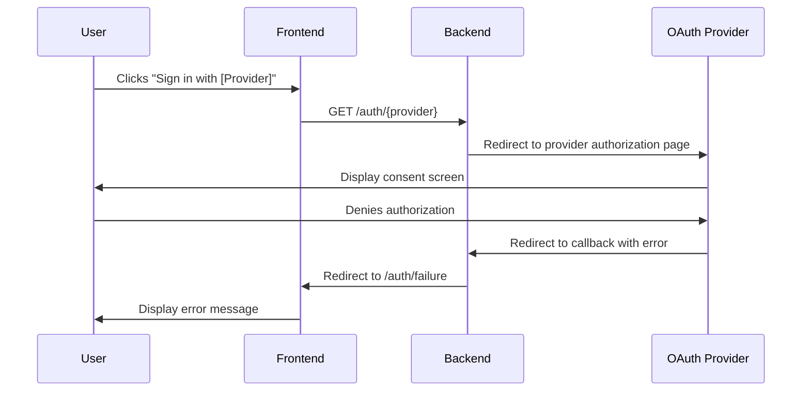
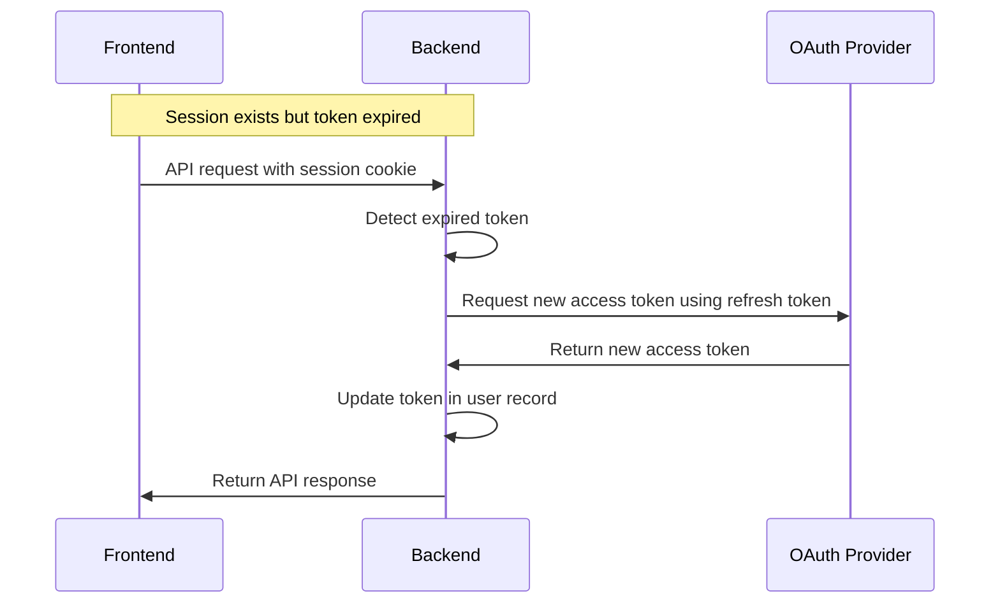

# PassportLink Authentication Flows - Sequence Diagrams

This document outlines the various authentication flows supported by PassportLink and their sequence diagrams.

## Initial Authentication Flow

## Account Linking Flow

## Account Unlinking Flow

## Logout Flow

## Get User Information Flow

## Get Available Providers Flow

## Error Handling Flow

## Token Refresh Flow (Implicit)

